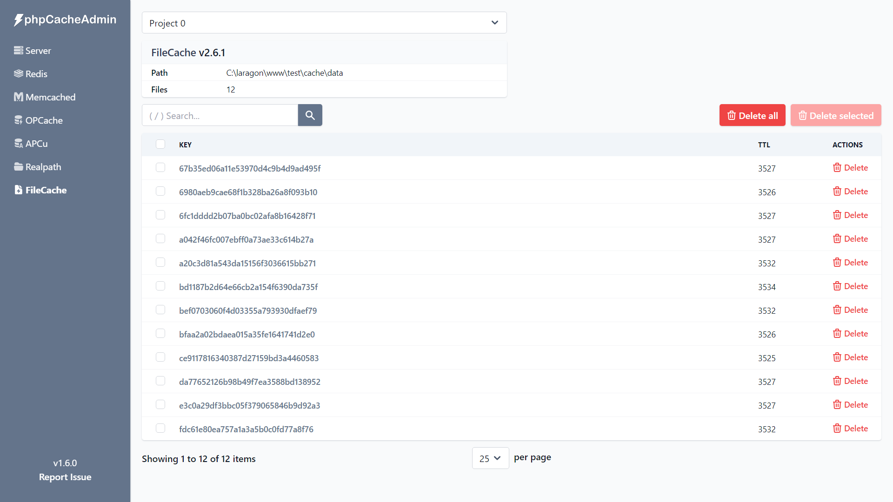

# FileCache-Dashboard

[phpCacheAdmin](https://github.com/RobiNN1/phpCacheAdmin) Dashboard for FileCache from [`robinn/cache`](https://github.com/RobiNN1/Cache).




## Installation

```
composer require robinn/filecache-dashboard
```

In phpCacheAdmin's `config.php` file add class to the `dashboards` and add `filecache` config

```php
'dashboards' => [
    ...
    RobiNN\FileCache\FileCacheDashboard::class,
],
'filecache'  => [
    [
        'name' => 'Project Name', // Optional
        'path' => __DIR__.'/path/to/cache/data',
    ],
],
```

For this to work, phpCacheAdmin should be in the same directory as
the project or have access to folders outside of website root.

## Requirements

- PHP >= 7.4
- phpCacheAdmin >= 1.3.1

## Testing

PHPUnit

```
composer test
```

PHPStan

```
composer phpstan
```
